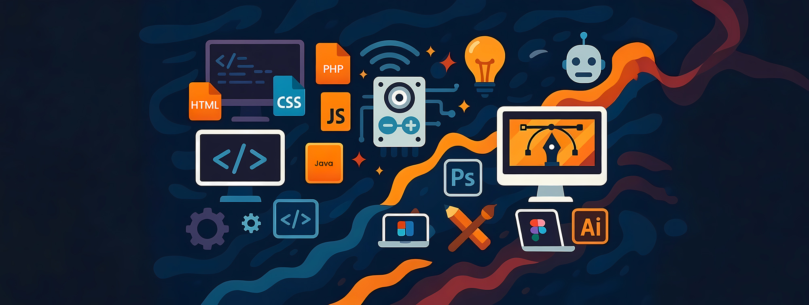

<!-- Profile README for ruwanmadhu -->

<h1 align="center">
  Hi!  I'm Ruwan Madhuwantha
</h1>

<h3 align="center">💻 Software & Web Developer · 🎨 Graphic Designer · 🌐 IoT Enthusiast · 🤖 Tech Geek</h3>

<!-- small, subtle animated SVG (not a GIF) -->

  

---

## 🌟 About Me

- Passionate about **software & web development**  
- Skilled in **graphic designing & creative UI/UX**  
- Exploring **IoT, Arduino, NodeMCU & ESP modules**  
- Designing **beautiful interfaces** and **coding powerful systems**

---

## 🚀 Languages I Work With
<table align="center">
  <tr>
    <td align="center" width="90">
       HTML5
    </td>
    <td align="center" width="90">
       CSS3
    </td>
    <td align="center" width="90">
       JavaScript
    </td>
    <td align="center" width="90">
       PHP
    </td>
    <td align="center" width="90">
       MySQL
    </td>
    <td align="center" width="90">
       Java
    </td>
    <td align="center" width="90">
       Python
    </td>
  </tr>
</table>

---

## 🛠️ Tools & Platforms
<table align="center">
  <tr>
    <td align="center" width="120">
       Git
    </td>
    <td align="center" width="120">
       Linux
    </td>
    <td align="center" width="120">
       VS Code
    </td>
  </tr>
</table>
  </tr>
</table>

---

## 🎨 Designing
<table align="center">
  <tr>
    <td align="center" width="120">
       Photoshop
    </td>
    <td align="center" width="120">
       Illustrator
    </td>
    <td align="center" width="120">
       Figma
    </td>
  </tr>
  
</table>

## 🌐 IoT & Hardware
<table align="center">
  <tr>
    <td align="center" width="120">
       Arduino
    </td>
    <td align="center" width="120">
       ESP8266/ESP01
    </td>
  </tr>
</table>

## 📊 GitHub Statistics

<table align="center" width="100%">
  <tr>
    <td align="center" colspan="2">
      
    </td>
  </tr>
  <tr>
    <td align="center" width="50%">
      
    </td>
    <td align="center" width="50%">
      
    </td>
  </tr>
</table>

---

## 🌐 Connect with Me

  
  &nbsp;&nbsp;
  
  &nbsp;&nbsp;
  
  &nbsp;&nbsp;
  

---

⭠<i>Fueled by curiosity | Building code, design & IoT solutions that inspire</i> 🚀

